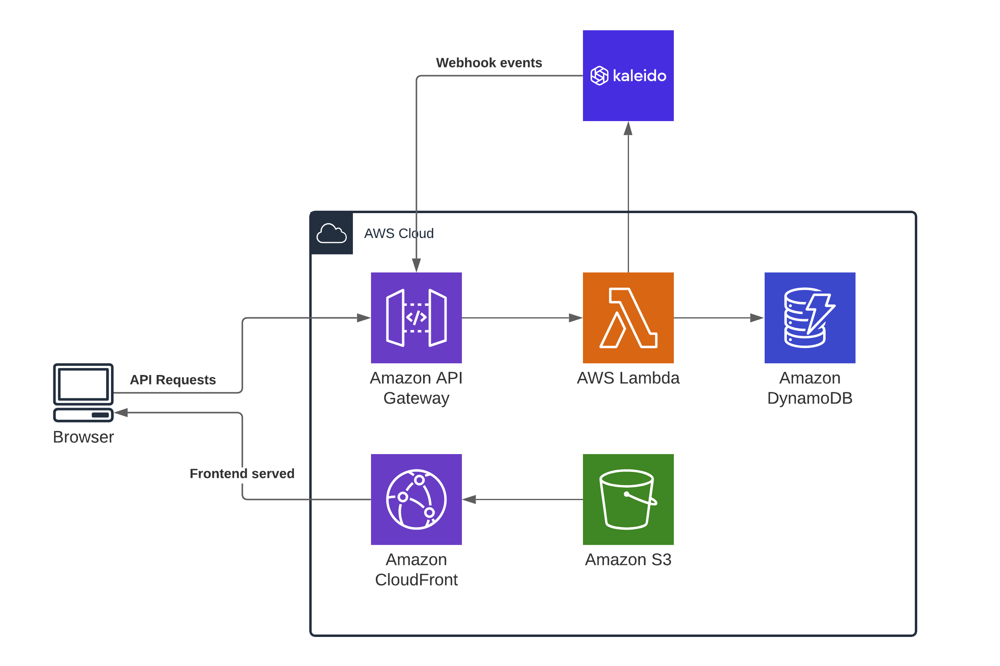
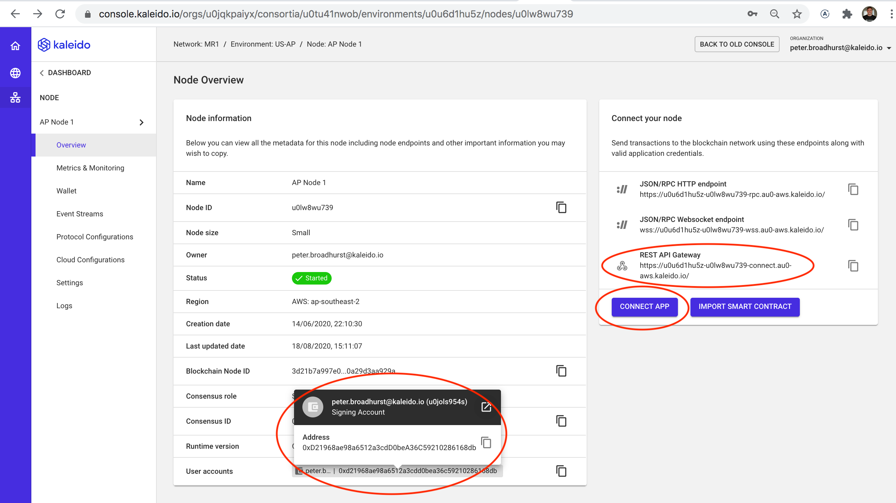

# BOOKCHAIN
*Book borrowing backed by blockchain*


## Architecture Overview
Bookchain uses [Kaleido](https://www.kaleido.io) for a private blockchain as an authoritative record of the history of the borrowed books. While merely a technology demonstration or sample app, Bookchain was designed to be built on "production grade" architecture, meaning it is linearly scalable and has repeatable deployments.

Bookchain runs on AWS leveraging several services to achieve its scalability goals:
 - The React based frontend is served from Amazon S3 and distributed by CloudFront
 - API Gateway is used to serve HTTP requests and route them to the correct handler function
 - AWS Lambda functions serve all backend requests for the service
 - Book metadata, and a cache of the history is kept in DynamoDB
 - Kaleido's blockchain is the final authority on book borrowing transactions
 - Kaleido sends events via webhook back to Bookchain when transactions successfully complete. These webhooks also go through API Gateway, call a Lambda function, and are cached in DynamoDB to create a way to quickly query the history of a particular book.




## Prerequisites
You can quickly and easily set up your own copy of Bookchain but you'll need to make sure you have a few things in place first.

### AWS CLI
Because Bookchain runs on AWS Services, you'll need an AWS account as well as the AWS CLI installed and configured with credentials on the machine you are going to deploy Bookchain from. For details on how to set up the AWS CLI, please see: https://docs.aws.amazon.com/cli/latest/userguide/install-cliv2.html

### Node.js
You will need to have Node.js (`node` and `npm`) installed and on the path of the machine that you are deploying Bookchain from. For details on installing Node.js please see: https://nodejs.org/en/download/

### Kaleido
You will need a Kaleido account (free tier is fine) to host your blockchain. After you set up your account, please run through [Kaleido's 
Quickstart Guide](https://docs.kaleido.io/using-kaleido/quick-start-ethereum/first-blockchain/) to make sure your workspace is set up and you have a Node ready.

## Project setup
To deploy the project, you now just have to grab the code and update one configuration file. Here's out to do that:

### Clone the repo
```bash
$ git clone https://github.com/nguyer/bookchain.git
$ cd bookchain
```

### Install dependencies
```bash
$ npm install
```
> **NOTE**: The `package.json` file is set up to automatically install dependencies for the frontend project also, after installing the backend dependencies.

### Create `kaleidoConfig.json`
```bash
$ cp kaleidoConfig.default.json kaleidoConfig.json
```
Open `kaleidoConfig.json` in your favorite editor and fill in the following values by grabbing them from your [Kaleido Console](https://console.kaleido.io)
```json
{
    "restApiGateway": "https://...kaleido.io/",
    "fromAddress": "...",
    "userId": "...",
    "password": "...",
}
```
- Go to your Node overview in the console
- Copy the REST API Gateway value and paste that into your config file as the value for `restApiGateway`.
- Click on User accounts and copy the Address. Paste this as value for the`fromAddress` field.



- Click the CONNECT APP button then Create new App Cred to create a username and password
- Copy the ID value and paste that as the `userId` in your config file
- Copy the Password value and paste that as the `password` in your config file


> **NOTE**: This file now has credentials. Please don't check it into source control.

## Deploy Bookchain
Now that you have the prerequisites and one time setup out of the way, you are ready to deploy Bookchain to the cloud. This is the exciting part! And it's also very easy. Just run:

```bash
$ npm run deploy
```

This will take some time, but here's a summary of what it will do:

- Deploy the Bookchain smart contract to Kaleido which will autogenerate a REST API
- Call the contract's constructor
- Save both the URL of the generated REST API and contract address to an output file to be passed to the next step
- Calls `serverless deploy` which does the following:
  - Compiles the TypeScript serverless functions and packages them in a .zip file
  - Fills in environment variables to let the Lambda functions call Kaleido APIs
  - Creates a CloudFormation stack with all of the AWS resources required to run Bookchain
  - Uploads the lambda functions and sets the new version active
- Runs a script to populate some sample data (books) into DynamoDB and the blockchain
- Creates an optimized production build of the frontend
- Uploads the built frontend to S3
- Prints out a friendly URL to click on to open your app 

###

### Run the frontend locally
To run the frontend locally (such as for development), you will need to set an environment variable to tell it the URL of the backend API. The easiest way to do that is to create a file at `./frontend/.env.local` and put the following line in it:

```bash
REACT_APP_BACKEND_URL=https://[API_GATEWAY_URL]
```

And replace `[API_GATEWAY_URL]` with the output from your serverless deployment. This can be found in `./devops/outputs/serverlessOutputs.json`